# Gitflow and Workflow

So how do we use git, Github and Gitflow to create our work flow and make good quality software?

## A Broad Overview

In the development process, we need to think about branches of code and how they interact over time. In our process, there are 3 types of branches; Master, Develop and Feature branches. This structure is not enforced by git or Github, but it's the approach taken by Gitflow.

So, our branches. Our 'busiest' branch is the develop branch. This is where the software product as a whole is developed, where things are tried out and the branch that all the devs are developing. When we're finished with what we've been working on, we can then create a 'release' using Gitflow. This is done by taking everything we've done in develop and merging it in to the master branch, so that the master branch is always pointing at the latest 'tagged release'. The master branch is the final product, it's the software that the customer or user is allowed to use. In our case, it's the software that is uploaded to the servers. Each merge in to the master branch has a release number (e.g. v0.0.2 or v1.0)

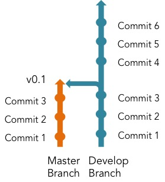

But it would be too complicated for all the devs to be working on different ideas at the same time on the same branch. So to do this, each dev or dev team works on a different branch, a feature branch. So, say for example we're working on a website and we want to

- add search functionality
- display a picture along with articles
- fix a bug

Finishing those objectives will constitute a release. A feature branch will be created for each of the features (surprise!).

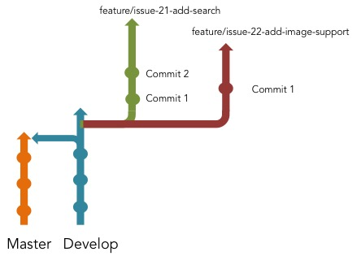

So, each branch gives a developer an isolated workspace in which to make changes and add code, without breaking the whole system.

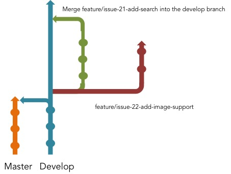

The feature is finished once the changes have been reviewed and tested (a process explained later on in  detail), we will merge that branch back into the develop branch.

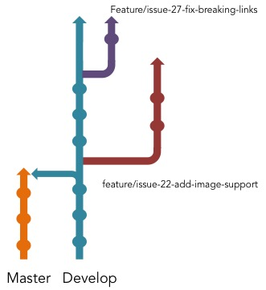

This process will continue for each branch, until we're finished with each feature and have merged it back into the develop branch.

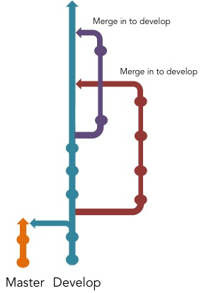

And finally, once we've added the features we wanted, and we're sure that our develop branch is working like its supposed to, we can create a release.

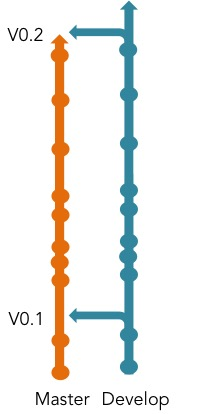

This is an overview of how the process works. In the next section, I'll go more in depth about the commands you'll use, and how you'll be working with a local repo on your machine and communicating with the repos on the GitHub servers.

## The Detailed Process

The first thing we need is a repository to work on. This will already be created on GitHub under the Praekelt or Unicore Organizations. You will the clone the repo using

```
$ git clone <REPO SSH URL>
```

So for example

```
$ git clone git@github.com:universalcore/springboard.git
```

Congrats! You've now got a local version of the code that's hosted on the GitHub servers. It looks something like this:

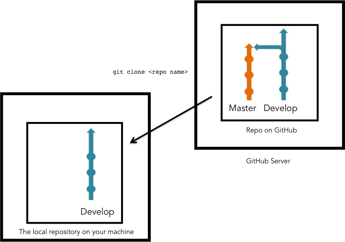

Note that you only have the develop branch on your machine. This is because it will only clone the default branch from github. You need to set up a local version of the master branch and then use gitflow (make sure it's installed) to take care of some of stuff behind the scenes, which you don't need to worry about.

```
$ cd <repo name>
$ git checkout master
```

This will automatically create a local master branch and switch you to the master branch, switch back to the develop branch and use Gitflow to work its magic

```
$ git checkout develop
$ git flow init
```

You'll get a bunch of options that you need to confirm that looks like this:
```
Branch name for production releases: [master]
Branch name for "next release" development: [develop]
Feature branches? [feature/]
Release branches? [release/]
Hotfix branches? [hotfix/]
```

Simply accept the defaults and stuff has happened!

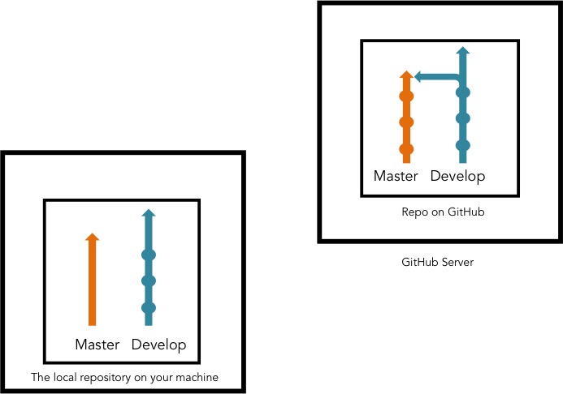

Next, you need to create and start up your virtualenv, which is explained [in a later article](./virtualenv.html).

```
$ virtualenv ve
$ source ve/bin/activate
(ve)$
```

The `(ve)` that appears in the command line, is telling you that the virtualenv is activated. Then you'll need to install the packages that will allow the code to run locally on your machine. The packages are listed in a file called `requirements.txt` in most cases and there may also be `requirements-dev.txt`. Luckily, we use [pip](http://en.wikipedia.org/wiki/Pip_%28package_manager%29) to take care of all of that for us. Make sure your virtualenv is activated for the appropriate repo and then simply run the following commands:

```
(ve)$ pip install -r requirements.txt
(ve)$ pip install -r requirements-dev.txt
```

This is the standard way to set things up, but it may differ from repo to repo. Check out the repo's readme file for instructions. There may also be a `bootstrap.sh` file in the repo, in which case you can skip the instructions from the virtualenv to here, and simply run:

```
$ sh bootstrap.sh
```

Great! So your local machine *should* be set up, but there are invariably problems the first couple of times. Ask a real live human to help you out :)

OK, so back to Github and Gitflow.

You're going to want to create a branch to work on your feature. First, create an issue on GitHub, at the appropriate repo. [This article](https://help.github.com/articles/creating-an-issue/) explains how to do that. Once the issue has been created, GitHub automatically creates an issue number. It's important because we use it to name our branches in a logical fashion.


Make sure your repo is up to date with `git pull` and now you need to come up with the name for your branch, which will look like

```
feature/issue-<ISSUE NUMBER>-<BRIEF DESCRIPTION, SEPARATED BY DASH "-" >
```

So you will need to enter this command

```
$ git flow feature start issue-<ISSUE NUMBER>-<BRIEF DESCRIPTION, SEPARATED BY DASH "-" >
```

So in our example we would use the following command:

```
$ git flow feature start issue-21-add-search
```

Now we've got something that looks like this:

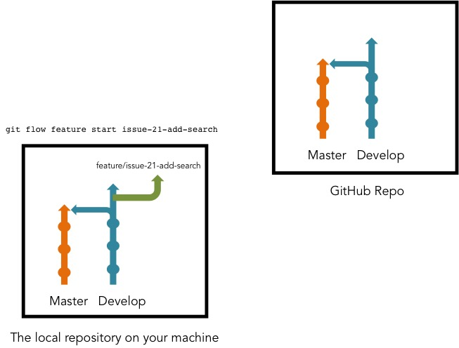

You've just created a branch on your local machine, but you now need to show everyone what you're doing by getting that branch on to the GitHub servers. You do this using the following:

```
git flow feature publish issue-<NAME>
```

So with our example, you would enter the following

```
git flow feature publish issue-21-add-search
```

There is now a remote version of your branch. You can also check on the github repo that your branch has been listed. If you get an error, the most likely cause is that you don't have push permissions. Contact an overlord to give you access.

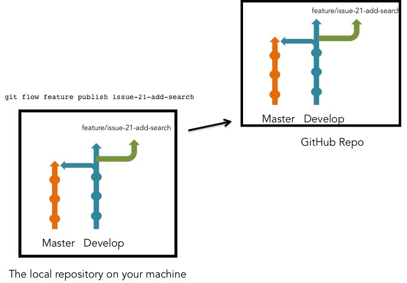

You're now ready to actually start writing code, get cracking! As you complete each unit of work, you will create a commit. See this article about [what's in a good commit](http://dev.solita.fi/2013/07/04/whats-in-a-good-commit.html).

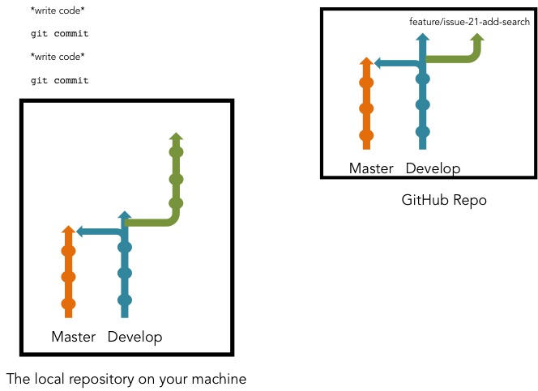

Now, you need to update the GiHub repo to ensure that if anyone wants to look at your code, it's up to date. You do that using:

```
$ git push
```

and assuming no errors . . .

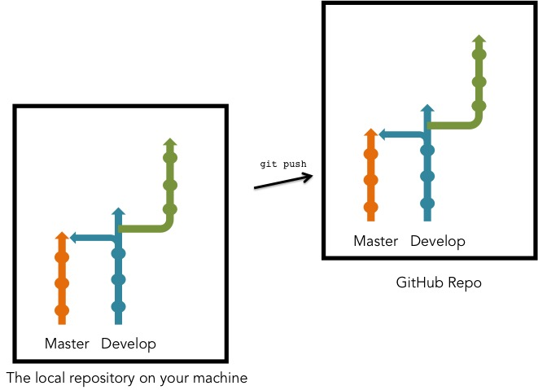

That step is really important, along with `git pull`, if you're working in a group and everyone is adding and changing things. Make sure you `git pull` and `git push` regularly and communicate with group members on what you're doing, to avoid merge conflicts.

Once you've written your code, created passing tests and you think your code is ready to merge, you need to create a pull request. This allows other developers to review your code, spot bugs and suggest improvements using GitHub. This is an integral part of the code process. It allows developers to keep up to date, see what progress has been made and learn about new approaches or coding methods. [Here's an article about why it's totes important](http://davidbolton.net/blog/2014/06/06/code-reviewing/).

Make sure you're

- on the right branch
- everything is committed and pushed
- you have [hub](https://hub.github.com/) installed

then check the issue number again (this is why it's important!) and then enter the following:

```
$ hub pull-request -b develop -i <ISSUE NUMBER>
```

In our example, it would be

```
$ hub pull-request -b develop -i 21
```

This will summarize all the changes you've made and will allow other developers to review your code. It will also test the entirety of your code using [Travis](https://travis-ci.org/) and let you know if stuff is broken, but I'll deal more in depth with testing in another article. Here's an excerpt from a pull request (PR). [Here's an actual PR on GitHub](https://github.com/universalcore/springboard/pull/20).

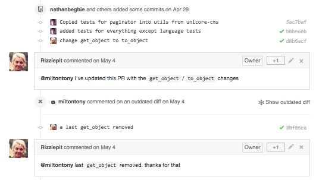

Other devs are able to point out mistakes that can be made in your code
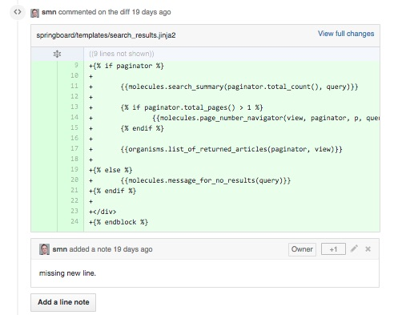

You can always create a pull request before you're completely ready, in order to make collaboration easier. When you want final approval, simply 'ping' the appropriate superior using their GitHub handle or on Slack and ask for a review. If you're on Slack, include the PR link. If they're happy, they'll give you a +1 or thumbs up, like so:

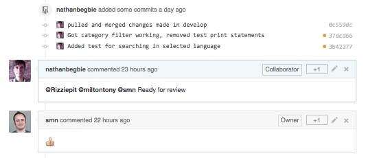

Just before you start celebrating however, you need to make sure that there haven't been changes in the develop branch that conflict with the code you've crafted in your feature branch. It's better to solve any potential issues before merging, so what we do is merge an up-to-date develop branch into our feature branch like so:

```
$ git checkout develop
$ git pull
$ git checkout feature/<BRANCH NAME>
$ git pull origin develop
```

You will then need to deal with any issues that arise and may need further review from devs.

Now, and only now, can you merge your feature into the develop branch using

```
$ git flow feature finish <BRANCH NAME>
```

In our example:

```
$ git flow feature finish issue-21-add-search
```

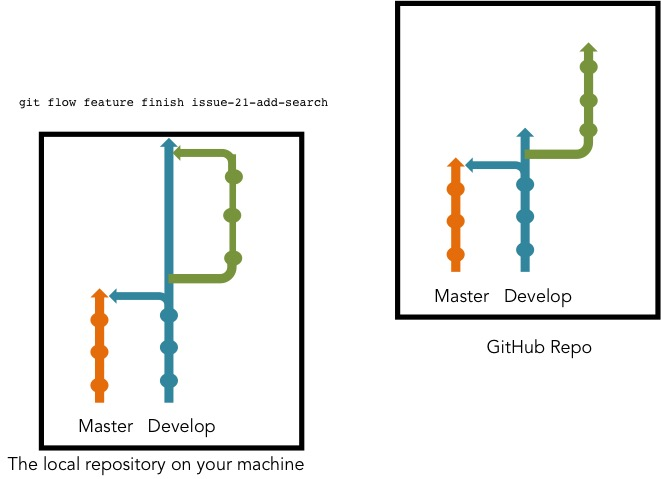

Note that the change is only made locally, SO MAKE SURE YOU PUSH! I have forgotten to do this last step before and ran into a multitude of merge conflicts when I finally realised my mistake :/

```
$ git push
```

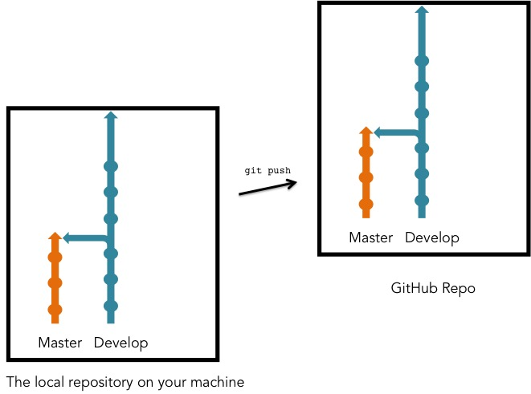

So, develop now has a new feature! It will be up to a more senior developer to create the relase using gitflow.


But remember that those changes will be made on the github server and not your machine, so `git pull` in order to get the updated version.

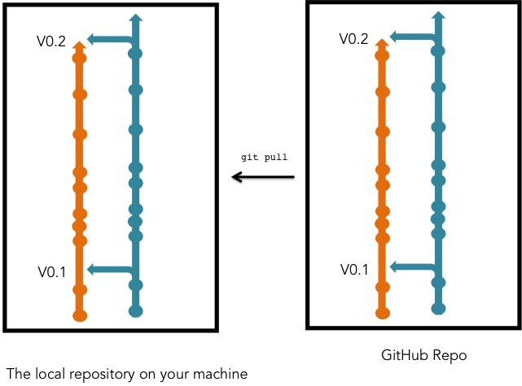

## Conclusion
There are some things that were not covered in depth here like testing and some of the tools we use, but this has been a breakdown and explanation of the workflow and how we use git, github and gitflow to maximize our code quality and make everyone's jobs easier, although it might not seem very simple right now!

Things to note:

- Things like quality assurance from project managers and the broader software creation process is not covered here.
- Here's [an article that's just about gitflow](http://danielkummer.github.io/git-flow-cheatsheet/) that explains it in a more general sense.
